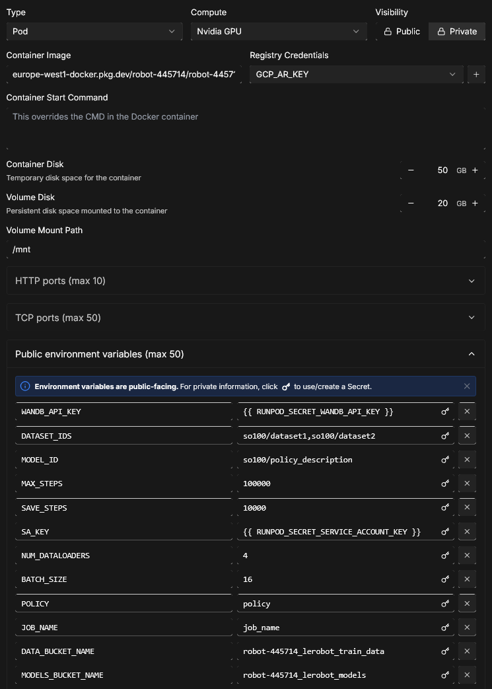
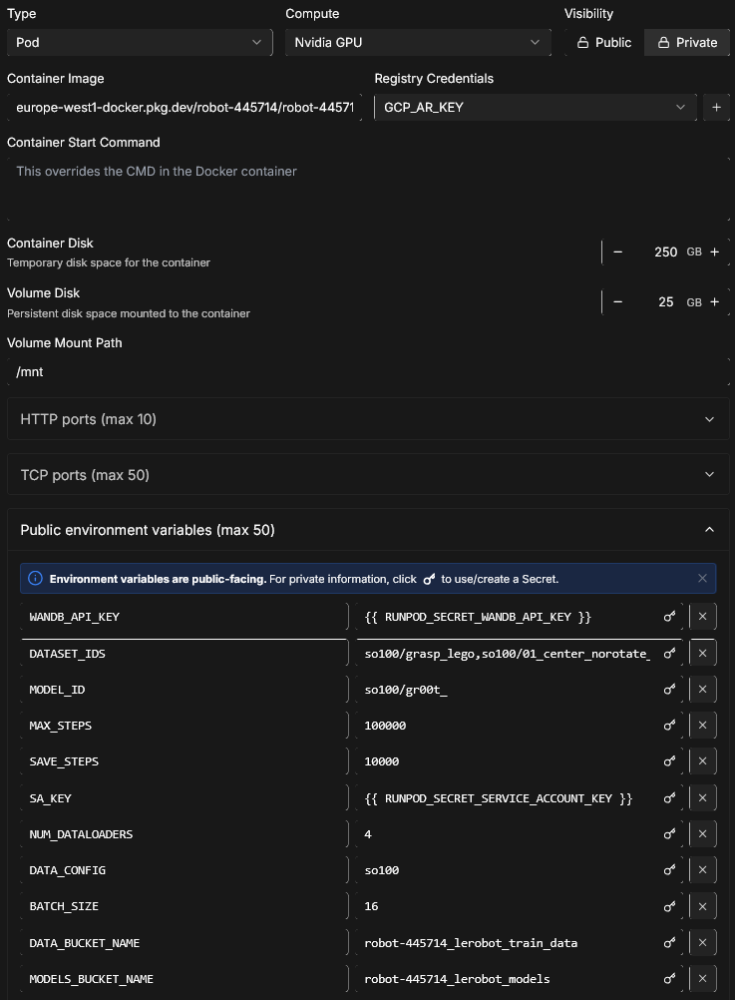
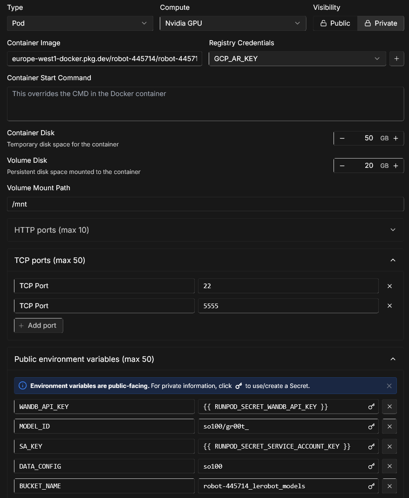

## Installation

Download the source code:
```bash
git clone git@bitbucket.org:ml6team/lerobot-utils.git
cd lerobot-utils
```

Create a virtual environment with Python 3.10 and activate it, e.g. with [`miniconda`](https://docs.anaconda.com/free/miniconda/index.html):
```bash
conda create -y -n lerobot python=3.10
conda activate lerobot
```

When using `miniconda`, install `ffmpeg` in your environment:
```bash
conda install ffmpeg -c conda-forge
```

> **NOTE:** This usually installs `ffmpeg 7.X` for your platform compiled with the `libsvtav1` encoder. If `libsvtav1` is not supported (check supported encoders with `ffmpeg -encoders`), you can:
>  - _[On any platform]_ Explicitly install `ffmpeg 7.X` using:
>  ```bash
>  conda install ffmpeg=7.1.1 -c conda-forge
>  ```
>  - _[On Linux only]_ Install [ffmpeg build dependencies](https://trac.ffmpeg.org/wiki/CompilationGuide/Ubuntu#GettheDependencies) and [compile ffmpeg from source with libsvtav1](https://trac.ffmpeg.org/wiki/CompilationGuide/Ubuntu#libsvtav1), and make sure you use the corresponding ffmpeg binary to your install with `which ffmpeg`.

Install 🤗 LeRobot:
```bash
pip install -e .
```

> **NOTE:** If you encounter build errors, you may need to install additional dependencies (`cmake`, `build-essential`, and `ffmpeg libs`). On Linux, run:
`sudo apt-get install cmake build-essential python3-dev pkg-config libavformat-dev libavcodec-dev libavdevice-dev libavutil-dev libswscale-dev libswresample-dev libavfilter-dev pkg-config`. For other systems, see: [Compiling PyAV](https://pyav.org/docs/develop/overview/installation.html#bring-your-own-ffmpeg)

To use [Weights and Biases](https://docs.wandb.ai/quickstart) for experiment tracking, log in with
```bash
wandb login
```

(note: you will also need to enable WandB in the configuration. See below.)

## Walkthrough

```
.
├── examples             # contains demonstration examples, start here to learn about LeRobot
|   └── advanced         # contains even more examples for those who have mastered the basics
├── lerobot
|   ├── configs          # contains config classes with all options that you can override in the command line
|   ├── common           # contains classes and utilities
|   |   ├── datasets       # various datasets of human demonstrations: aloha, pusht, xarm
|   |   ├── envs           # various sim environments: aloha, pusht, xarm
|   |   ├── policies       # various policies: act, diffusion, tdmpc
|   |   ├── robot_devices  # various real devices: dynamixel motors, opencv cameras, koch robots
|   |   └── utils          # various utilities
|   └── scripts          # contains functions to execute via command line
|       ├── eval.py                 # load policy and evaluate it on an environment
|       ├── train.py                # train a policy via imitation learning and/or reinforcement learning
|       ├── control_robot.py        # teleoperate a real robot, record data, run a policy
|       ├── push_dataset_to_hub.py  # convert your dataset into LeRobot dataset format and upload it to the Hugging Face hub
|       └── visualize_dataset.py    # load a dataset and render its demonstrations
├── outputs               # contains results of scripts execution: logs, videos, model checkpoints
└── tests                 # contains pytest utilities for continuous integration
```

### The `LeRobotDataset` format

A dataset in `LeRobotDataset` format is very simple to use. It can be loaded from a repository on the Hugging Face hub or a local folder simply with e.g. `dataset = LeRobotDataset("lerobot/aloha_static_coffee")` and can be indexed into like any Hugging Face and PyTorch dataset. For instance `dataset[0]` will retrieve a single temporal frame from the dataset containing observation(s) and an action as PyTorch tensors ready to be fed to a model.

A specificity of `LeRobotDataset` is that, rather than retrieving a single frame by its index, we can retrieve several frames based on their temporal relationship with the indexed frame, by setting `delta_timestamps` to a list of relative times with respect to the indexed frame. For example, with `delta_timestamps = {"observation.image": [-1, -0.5, -0.2, 0]}`  one can retrieve, for a given index, 4 frames: 3 "previous" frames 1 second, 0.5 seconds, and 0.2 seconds before the indexed frame, and the indexed frame itself (corresponding to the 0 entry). See example [1_load_lerobot_dataset.py](examples/1_load_lerobot_dataset.py) for more details on `delta_timestamps`.

Under the hood, the `LeRobotDataset` format makes use of several ways to serialize data which can be useful to understand if you plan to work more closely with this format. We tried to make a flexible yet simple dataset format that would cover most type of features and specificities present in reinforcement learning and robotics, in simulation and in real-world, with a focus on cameras and robot states but easily extended to other types of sensory inputs as long as they can be represented by a tensor.

Here are the important details and internal structure organization of a typical `LeRobotDataset` instantiated with `dataset = LeRobotDataset("lerobot/aloha_static_coffee")`. The exact features will change from dataset to dataset but not the main aspects:

```
dataset attributes:
  ├ hf_dataset: a Hugging Face dataset (backed by Arrow/parquet). Typical features example:
  │  ├ observation.images.cam_high (VideoFrame):
  │  │   VideoFrame = {'path': path to a mp4 video, 'timestamp' (float32): timestamp in the video}
  │  ├ observation.state (list of float32): position of an arm joints (for instance)
  │  ... (more observations)
  │  ├ action (list of float32): goal position of an arm joints (for instance)
  │  ├ episode_index (int64): index of the episode for this sample
  │  ├ frame_index (int64): index of the frame for this sample in the episode ; starts at 0 for each episode
  │  ├ timestamp (float32): timestamp in the episode
  │  ├ next.done (bool): indicates the end of an episode ; True for the last frame in each episode
  │  └ index (int64): general index in the whole dataset
  ├ episode_data_index: contains 2 tensors with the start and end indices of each episode
  │  ├ from (1D int64 tensor): first frame index for each episode — shape (num episodes,) starts with 0
  │  └ to: (1D int64 tensor): last frame index for each episode — shape (num episodes,)
  ├ stats: a dictionary of statistics (max, mean, min, std) for each feature in the dataset, for instance
  │  ├ observation.images.cam_high: {'max': tensor with same number of dimensions (e.g. `(c, 1, 1)` for images, `(c,)` for states), etc.}
  │  ...
  ├ info: a dictionary of metadata on the dataset
  │  ├ codebase_version (str): this is to keep track of the codebase version the dataset was created with
  │  ├ fps (float): frame per second the dataset is recorded/synchronized to
  │  ├ video (bool): indicates if frames are encoded in mp4 video files to save space or stored as png files
  │  └ encoding (dict): if video, this documents the main options that were used with ffmpeg to encode the videos
  ├ videos_dir (Path): where the mp4 videos or png images are stored/accessed
  └ camera_keys (list of string): the keys to access camera features in the item returned by the dataset (e.g. `["observation.images.cam_high", ...]`)
```

A `LeRobotDataset` is serialised using several widespread file formats for each of its parts, namely:
- hf_dataset stored using Hugging Face datasets library serialization to parquet
- videos are stored in mp4 format to save space
- metadata are stored in plain json/jsonl files

Dataset can be uploaded/downloaded from the HuggingFace hub seamlessly. To work on a local dataset, you can specify its location with the `root` argument if it's not in the default `~/.cache/huggingface/lerobot` location.

### Train your own policy

Check out [example 3](./examples/3_train_policy.py) that illustrates how to train a model using our core library in python, and [example 4](./examples/4_train_policy_with_script.md) that shows how to use our training script from command line.

To use wandb for logging training and evaluation curves, make sure you've run `wandb login` as a one-time setup step. Then, when running the training command above, enable WandB in the configuration by adding `--wandb.enable=true`.

A link to the wandb logs for the run will also show up in yellow in your terminal. Here is an example of what they look like in your browser. Please also check [here](./examples/4_train_policy_with_script.md#typical-logs-and-metrics) for the explanation of some commonly used metrics in logs.


Note: For efficiency, during training every checkpoint is evaluated on a low number of episodes. You may use `--eval.n_episodes=500` to evaluate on more episodes than the default. Or, after training, you may want to re-evaluate your best checkpoints on more episodes or change the evaluation settings. See `python lerobot/scripts/eval.py --help` for more instructions.

## Useful example commands:
More in the `examples/` folder

### USB port discovery
```bash
python lerobot/scripts/find_motors_bus_port.py
```
Adjust `lerobot/common/robot_devices/robots/configs.py` accordingly.

### Calibration
Do this for all your arms.
```bash
python lerobot/scripts/control_robot.py \
  --robot.type='so100' \
  --robot.cameras='{}' \
  --control.type='calibrate' \
  --control.arms='["main_follower"]'
```

### Teleoperation
```bash
python lerobot/scripts/control_robot.py \
  --robot.type='so100' \
  --control.type='teleoperate' \
  --control.fps=30 \
  --control.display_data=true
```

### Dataset recording
```bash
python lerobot/scripts/control_robot.py \
  --robot.type='so100' \
  --control.type='record' \
  --control.fps=30 \
  --control.single_task="Fold a towel." \
  --control.repo_id="so100/fold_towel" \
  --control.num_episodes=10 \
  --control.warmup_time_s=20 \
  --control.episode_warmup_time_s=10 \
  --control.episode_time_s=60 \
  --control.reset_time_s=2 \
  --control.display_data=true \
  --control.gcs_bucket_name="robot-445714_lerobot_train_data" \
  --control.push_to_hub=false
```

### Model evaluation
*WARNING:* Evaluating ACT will save attention mapped images in the `outputs/attention_map/` folder. This is a rough and hasty implementation. A more robust solution is advised.
```bash
python lerobot/scripts/control_robot.py \
  --robot.type='so100' \
  --control.type='record' \
  --control.fps=30 \
  --control.single_task="Unfold a towel." \
  --control.repo_id="so100/eval_act_unfold_am_cp-60k" \
  --control.num_episodes=10 \
  --control.warmup_time_s=2 \
  --control.episode_time_s=90 \
  --control.reset_time_s=10 \
  --control.display_data=true \
  --control.push_to_hub=false \
  --control.gcs_bucket_name="robot-445714_lerobot_eval_data" \
  --control.policy.path="gs://robot-445714_lerobot_models/so100/act_unfold_2/checkpoints/060000/pretrained_model"
```

## Google Cloud Storage

### Datasets
LeRobot dataset identifiers should use *group_name/dataset_name* as a format.  
It is recommended to use a different bucket for training data and model checkpoints.

### Models
Model identifiers should use *group_name/model_name* as a format.

### Commands
Pull and push datasets and models using this command. Multiple identifiers can be specified using `,` as a delimiter.
```bash
python lerobot/common/datasets/gcs_utils.py \
  --bucket_name="robot-445714_lerobot_models" \
  --action='pull' \
  --content_type='model' \
  --identifiers="so100/diffusion_unfold,so100/act_unfold"
```
Combine datasets and/or convert the video encoding using the following command.

Combining example:
```bash
python lerobot/common/datasets/combine_datasets.py \
  --repo_ids="so100/x0_y-2,so100/x0_y-1,so100/center,so100/x0_y1,so100/x0_y2"
  --combined_repo_id="so100/vertical_dataset"
```

Transcoding example:
```bash
python lerobot/common/datasets/combine_datasets.py \
  --repo_ids="so100/unfold_towel" \
  --combined_repo_id="so100/unfold_transcoded" \
  --video_encoder='h264' 
```

## LeRobot Remote Training
Build the docker image at `docker/lerobot-gpu/Dockerfile`  
Set up a pod using the template below. (recommended GPU: **A40**)

Secrets:  
`WANDB_API_KEY`  
`SA_KEY` Google Service Account key for bucket access.  

Public Environment Variables:  
`MODEL_ID`  
`MAX_STEPS`  
`SAVE_STEPS`  
`NUM_DATALOADERS`  
`BATCH_SIZE`  
`POLICY`  
`JOB_NAME`  
`DATA_BUCKET_NAME`  
`MODELS_BUCKET_NAME`  



## GR00T-N1
Clone the GR00T-N1 repository at `https://github.com/robindehullu-howest/Isaac-GR00T.git`

### Remote Fine-tuning
Build the docker image using `Dockerfile_ft`  
Set up a pod using the template below. (recommended GPU: **L40S**)

Secrets:  
`WANDB_API_KEY`  
`SA_KEY` Google Service Account key for bucket access.  

Public Environment Variables:  
`MODEL_ID`  
`MAX_STEPS`  
`SAVE_STEPS`  
`NUM_DATALOADERS`  
`DATA_CONFIG` - ['so100', 'so100_bimanual']  
`BATCH_SIZE`  
`DATA_BUCKET_NAME`  
`MODELS_BUCKET_NAME`  



### Remote inference server
Build the docker image using `Dockerfile_inf`  
Set up a pod **as closeby as possible** using the template below. (recommended GPU: **L40S**)

Make sure to specify TCP port 5555. When connecting, use the forwarded port to reach the inference server.

Secrets:  
`WANDB_API_KEY`  
`SA_KEY` Google Service Account key for bucket access.  

Public Environment Variables:  
`MODEL_ID`  - Specify the checkpoint subfolder *group_name/model_name/checkpoint-xxx*  
`DATASET_IDS` - `,` delimited string of required datasets on the gcs bucket  
`DATA_CONFIG` - ['so100', 'so100_bimanual']  



## Artifacts

### Training datasets
Bucket: `robot-445714_lerobot_train_data`  
Project: `robot-445714`  
Region: `europe-west1`  

Available datasets:  
 - Modular Lego brick PicknPlace datasets  
 - Additional Lego brick grasping dataset  
 - Unfolding dataset  
 - Folding dataset  

### Models
Bucket: `robot-445714_lerobot_models`  
Project: `robot-445714`  
Region: `europe-west1`  

Best performing checkpoints of models:  
 - act_vertical_norotate_sequential_long (Single-Axis Pick&Place)  
 - act_cross_extra_norotate_sequential_augmented (Augm. Dual-Axis P&P)  
 - act_unfold_tiny (Unfold Basic)  
 - diffusion_unfold (Unfold Diffusion)  
 - dot_unfold_a40 (Unfold DOT)  
 - gr00t_unfold (Unfold GR00T)  
 - gr00t_fold (Fold GR00T)  

### Evaluation datasets
Bucket: `robot-445714_lerobot_eval_data`  
Project: `robot-445714`  
Region: `europe-west1`  

Available datasets:  
 - eval_present_vertical  
 - eval_act_01_cross_norotate_sequential_cp  
 - eval_act_cross_norotate_sequential_cp-40k  
 - eval_act_cross_norotate_sequential_cp-60k  
 - eval_act_cross_norotate_sequential_cp-80k  
 - eval_act_cross_norotate_sequential_cp-100k  
 - eval_cross_extra_norotate_sequential_augmented_cp-60k  
 - eval_cross_extra_norotate_sequential_augmented_cp-100k  
 - eval_cross_extra_norotate_sequential_augmented_cp-240k  
 - eval_cross_extra_norotate_sequential_augmented_cp-300k  
 - eval_act_unfold_tiny  
 - eval_act_unfold_tiny_cp_60  
 - eval_diffusion_unfold_cp-90k  
 - eval_dot_unfold_cp-70k  